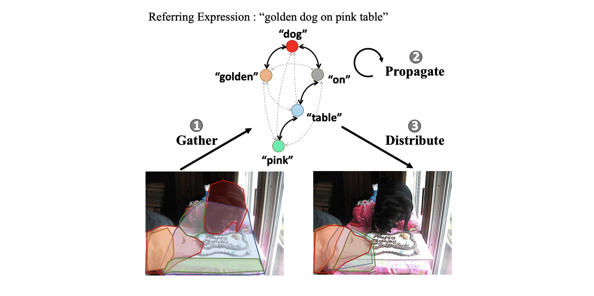

# LSCM-Refseg

Code of our ECCV 2020 paper [*Linguistic Structure Guided Context Modeling for Referring Image Segmentation*](https://www.ecva.net/papers/eccv_2020/papers_ECCV/papers/123550052.pdf).

Tianrui Hui, Si Liu, Shaofei Huang, Guanbin Li, Sansi Yu, Faxi Zhang, and Jizhong Han.

## Interpretation of LSCM.



We construct a **Dependency Parsing Tree suppressed Word Graph (DPT-WG)** to model multimodal context in three steps.

- **Gather**. Multimodal context relevant to each word are gathered as feature of each word node.
Therefore, each word corresponds to some visually relevant segments in the image.
For example, word “dog” corresponds to two red segments in the left image.

- **Propagate**. DPT is exploited to further guide each word node to include valid multimodal context from others and exclude disturbing ones through suppressed graph propagation routes.
Gray dotted and black solid lines denote suppressed and unsuppressed edges in DPT-WG respectively.

- **Distribute**. Features of all word nodes are distributed back to the image.
Segments corresponding to the input words are all clustered around the ground-truth segmentation region, i.e., the golden dog on pink table in the right image.
(Best viewed in color).

## Experimental Results

We modify the way of feature concatenation in the end of LSCM module and achieve higher performances than the results reported in our paper on most splits.
New experimental results are summarized in the table bellow.
You can download our trained checkpoints to test on the four datasets. The link to the checkpoints is:
[Baidu Drive](https://pan.baidu.com/share/init?surl=rOmmaTNhm8GIy93iuTBWgQ), pswd: kbhb.

| Method | UNC val | UNC testA | UNC testB | UNC+ val | UNC+ testA | UNC+ testB | G-Ref val | ReferIt test |
| :------: | :------: | :------: | :------: | :------: | :------: | :------: | :------: | :------: |
| STEP-ICCV19 \[1\] | 60.04 | 63.46 | 57.97 | 48.19 | 52.33 | 40.41| 46.40 | 64.13 |
| Ours-ECCV20 | 61.47 | **64.99** | 59.55 | 49.34 | **53.12** | 43.50 | 48.05 | 66.57 |
|Ours-Updated | **61.65** | 64.42 | **59.92** | **50.21** | 53.04 | **43.83** | **49.50** | **67.23** |

## Setup

We recommended the following dependencies.

* Python 2.7
* TensorFlow 1.5
* Numpy
* Spacy
* pydensecrf

This code is derived from [RRN](https://github.com/liruiyu/referseg_rrn) \[2\]. Please refer to it for more details of setup.

## Data Preparation
* **Dataset Preprocessing**

We conduct experiments on 4 datasets of referring image segmentation, including `UNC`, `UNC+`, `Gref` and `ReferIt`. After downloading these datasets, you can run the following commands for data preparation:
```
python build_batches.py -d Gref -t train
python build_batches.py -d Gref -t val
python build_batches.py -d unc -t train
python build_batches.py -d unc -t val
python build_batches.py -d unc -t testA
python build_batches.py -d unc -t testB
python build_batches.py -d unc+ -t train
python build_batches.py -d unc+ -t val
python build_batches.py -d unc+ -t testA
python build_batches.py -d unc+ -t testB
python build_batches.py -d referit -t trainval
python build_batches.py -d referit -t test
```

* **Glove Embedding Generation**

Please first download GloVe Embedding (glove.840B.300d.zip) from its officail website and save it to data/.
Then run the following commands to generate embeddings:

```
 python scripts/embedding_generate.py -d referit
 python scripts/embedding_generate.py -d Gref
```

## Training and Evaluation

For convenience, we further provide an example bash script to train on UNC train set and evaluate on val set by running the following command:

```
./trainval.sh
```

- **Training**. Specify several options/flags and then run `python trainval_model.py`
  - `m`: `train`, training mode
  - `d`: Specify dataset, `unc`, `unc+`, `Gref` or `referit`
  - `t`: Split of the dataset, `train` or `trainval`
  - `f`: Path to save the checkpoints
  
- **Evaluation**. Specify several options/flags and then run `python trainval_model.py`
  - `m`: `test`, evaluation mode
  - `d`: Specify dataset, `unc`, `unc+`, `Gref` or `referit`
  - `t`: Split of the dataset, `val`, `testA`, `testB` or `test`
  - `i`: 700000, checkpoint of which iteration to be evaluated with
  - `f`: Path where the checkpoints are saved
  
## Reference
\[1\] Chen, Ding-Jie, et al. "See-through-text grouping for referring image segmentation." Proceedings of the IEEE International Conference on Computer Vision. 2019.

\[2\] Li, Ruiyu, et al. "Referring image segmentation via recurrent refinement networks." Proceedings of the IEEE Conference on Computer Vision and Pattern Recognition. 2018.
